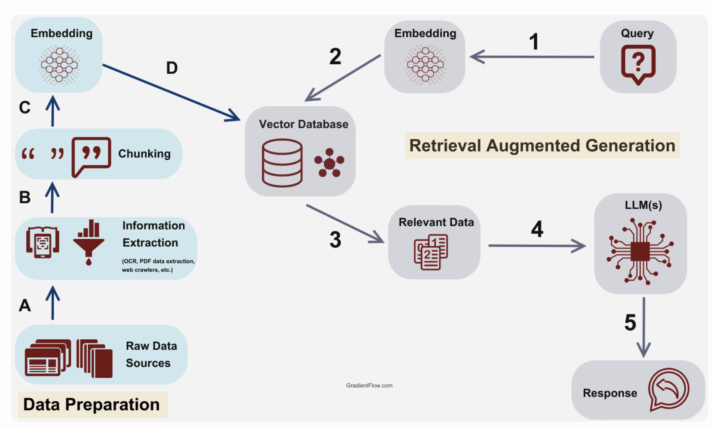

# newsLLM-RAG

A RAG (Retrieval-Augmented Generation) pipeline for Chinese news articles using hybrid search (dense + sparse vectors) with Qdrant.

## Pipeline Overview



## Prerequisites

- [uv](https://docs.astral.sh/uv/getting-started/installation/) — Python package manager
- [Docker](https://docs.docker.com/get-docker/) — for running Qdrant

## Setup

### 1. Install Python dependencies

```bash
uv sync
```

`uv sync` reads `pyproject.toml` and installs all required Python packages into an isolated virtual environment automatically.

### 2. Start Qdrant

```bash
docker compose up -d
```

This starts a Qdrant vector database in the background on port `6333`. Data is persisted in a Docker-managed volume so it survives container restarts.

To verify Qdrant is running:
```bash
curl -s http://localhost:6333/healthz
```

### 3. Run the indexing pipeline

```bash
uv run ingest.py
```

This runs the full indexing pipeline:
1. Load raw news articles from `notebooks/data/news.json`
2. Chunk each article into sentence windows
3. Embed chunks into dense + sparse vectors
4. Store vectors and metadata into Qdrant

### 4. Stop Qdrant

```bash
docker compose down
```

## Useful commands

```bash
# Check all Qdrant collections
curl -s http://localhost:6333/collections

# Check Qdrant version
curl -s http://localhost:6333
```